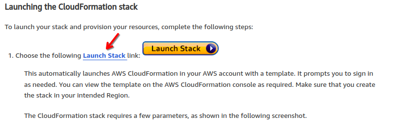

# EMR Monitoring - Prometheus + Grafana
Project to concentrate files and settings for AWS EMR monitoring. Source: https://aws.amazon.com/blogs/big-data/monitor-and-optimize-analytic-workloads-on-amazon-emr-with-prometheus-and-grafana/

## Important

This project was entirely based on the project contained in this URL: https://aws.amazon.com/blogs/big-data/monitor-and-optimize-analytic-workloads-on-amazon-emr-with-prometheus-and-grafana/

I just dismembered the scripts contained in the CloudFormation stack so that it was possible to customize some things I wanted. There is no intention to plagiarize any knowledge!

All merit and credits must be given to the AWS EMR team engineers who created a complete solution to easily provision resources.


## How to use this project

Build your cluster the way you want, either via the control panel, AWS-CLI or Terraform. You will need to add a configuration snippet for Hadoop to use JMX Exporter. You will also need to apply a script to bootstrap the cluster.

### Configuring the JMX Exporter on Hadoop
```
[
    {
      "Classification": "hadoop-env",
      "Configurations": [
        {
          "Classification": "export",
          "Properties": {
            "HADOOP_DATANODE_OPTS": "\"-javaagent:/etc/prometheus/jmx_prometheus_javaagent-0.14.0.jar=7001:/etc/hadoop/conf/hdfs_jmx_config_datanode.yaml -Dcom.sun.management.jmxremote -Dcom.sun.management.jmxremote.ssl=false -Dcom.sun.management.jmxremote.authenticate=false -Dcom.sun.management.jmxremote.port=50103\"",
            "HADOOP_NAMENODE_OPTS": "\"-javaagent:/etc/prometheus/jmx_prometheus_javaagent-0.14.0.jar=7001:/etc/hadoop/conf/hdfs_jmx_config_namenode.yaml -Dcom.sun.management.jmxremote -Dcom.sun.management.jmxremote.ssl=false -Dcom.sun.management.jmxremote.authenticate=false -Dcom.sun.management.jmxremote.port=50103\""
          }
        }
      ],
      "Properties": {}
    }
]
```
> Stay tuned in the defined version of the JMX Exporter, because if you change, you will need to change this section.

### Bootstrap

Upload the file [bootstrap.sh](prometheus/bootstrap_monitoring.sh) in S3 and then set the script path in the bootstrap step of the cluster.

## Grafana Dashboards

Since the dashboards were created by AWS, I will document how to get the dashboards to make the process easier. If AWS updates them, you will be able to get the dashboards yourself.

1. Access the project URL: https://aws.amazon.com/blogs/big-data/monitor-and-optimize-analytic-workloads-on-amazon-emr-with-prometheus-and-grafana/
2. Copy the Launch Stack link address:
> 
> Example: https://us-east-1.console.aws.amazon.com/cloudformation/home?region=us-east-1#/stacks/create/template?templateURL=https://aws-bigdata-blog.s3.amazonaws.com/artifacts/aws-blog-emr-prometheus-grafana/cloudformation_templates/emrPrometheusGrafana.cf.json
3. Copy only the parameter `templateurn`:
> Example: https://aws-bigdata-blog.s3.amazonaws.com/artifacts/aws-blog-emr-prometheus-grafana/cloudformation_templates/emrPrometheusGrafana.cf.json
4. Download the contents of this URL or visit via browser
5. In the file, search for the term `setup-grafana.sh` and download this file
> Example: `wget https://aws-bigdata-blog.s3.amazonaws.com/artifacts/aws-blog-emr-prometheus-grafana/scripts/setup-grafana.sh`
6. Download all files with the extension `.json`
> Example:
> ```sh
> wget https://aws-bigdata-blog.s3.amazonaws.com/artifacts/aws-blog-emr-prometheus-grafana/dashboards/HDFS+-+DataNode.json
> wget https://aws-bigdata-blog.s3.amazonaws.com/artifacts/aws-blog-emr-prometheus-grafana/dashboards/HDFS+-+NameNode.json
> wget https://aws-bigdata-blog.s3.amazonaws.com/artifacts/aws-blog-emr-prometheus-grafana/dashboards/JVM+Metrics.json
> wget https://aws-bigdata-blog.s3.amazonaws.com/artifacts/aws-blog-emr-prometheus-grafana/dashboards/Log+Metrics.json
> wget https://aws-bigdata-blog.s3.amazonaws.com/artifacts/aws-blog-emr-prometheus-grafana/dashboards/OS+Level+Metrics.json
> wget https://aws-bigdata-blog.s3.amazonaws.com/artifacts/aws-blog-emr-prometheus-grafana/dashboards/RPC+Metrics.json
> wget https://aws-bigdata-blog.s3.amazonaws.com/artifacts/aws-blog-emr-prometheus-grafana/dashboards/YARN+-+Node+Manager.json
> wget https://aws-bigdata-blog.s3.amazonaws.com/artifacts/aws-blog-emr-prometheus-grafana/dashboards/YARN+-+Queues.json
> wget https://aws-bigdata-blog.s3.amazonaws.com/artifacts/aws-blog-emr-prometheus-grafana/dashboards/YARN+-+Resource+Manager.json
> ```

### Important

I will keep the files in the repository if someone needs these dashboards in case of unavailability of the page. If someone identifies that there were changes, please open a PR with the new files.

[Grafana Dashboards directory](grafana-dashboards)